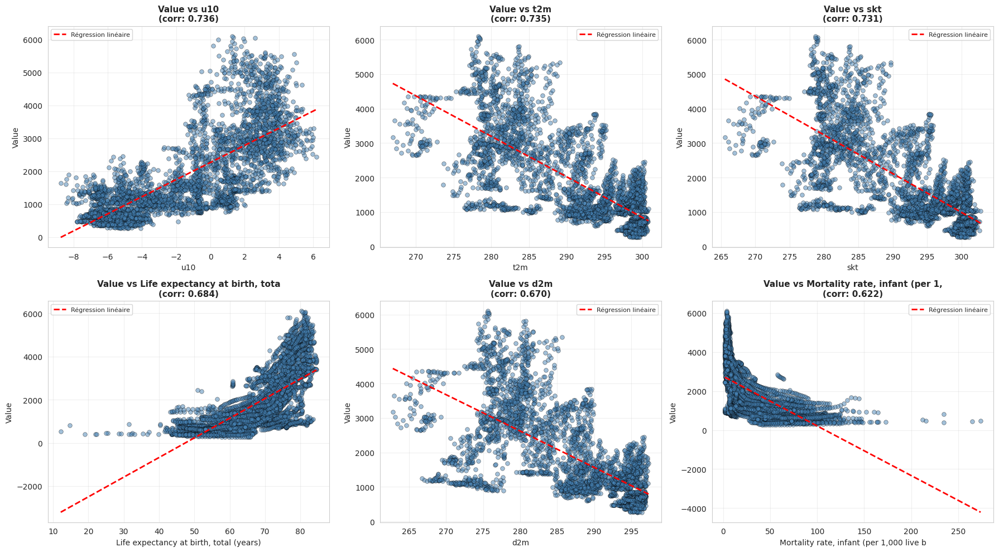
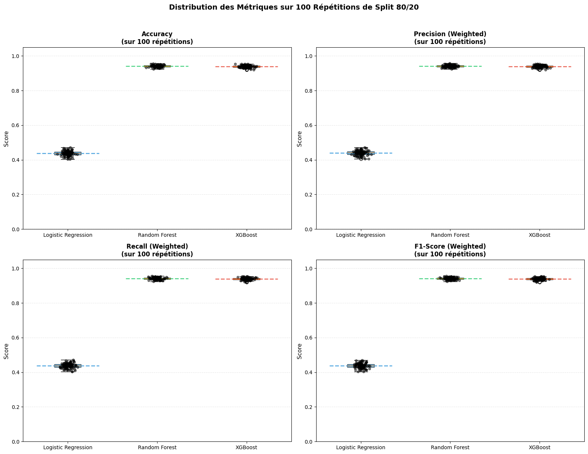
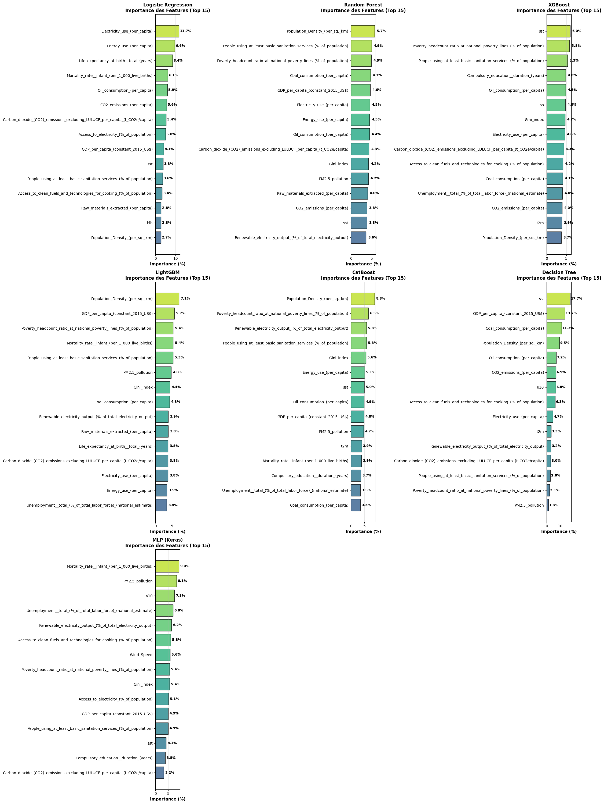
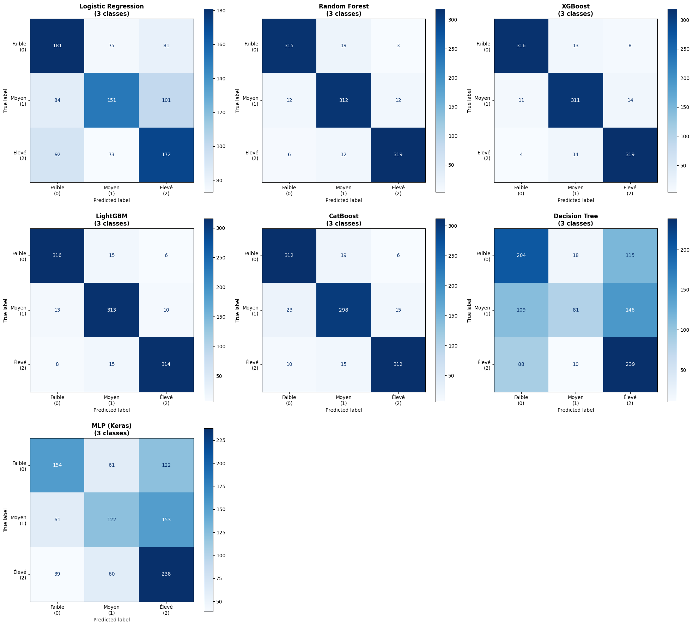
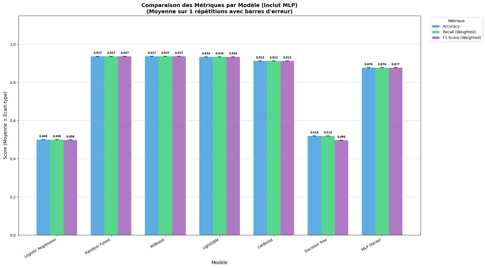
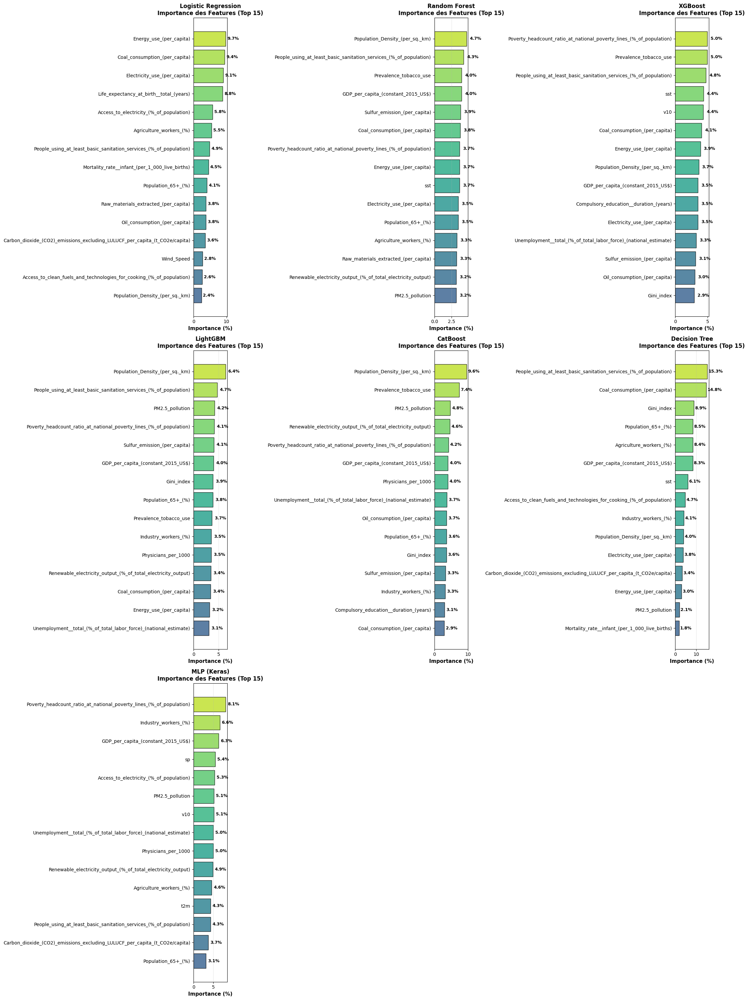
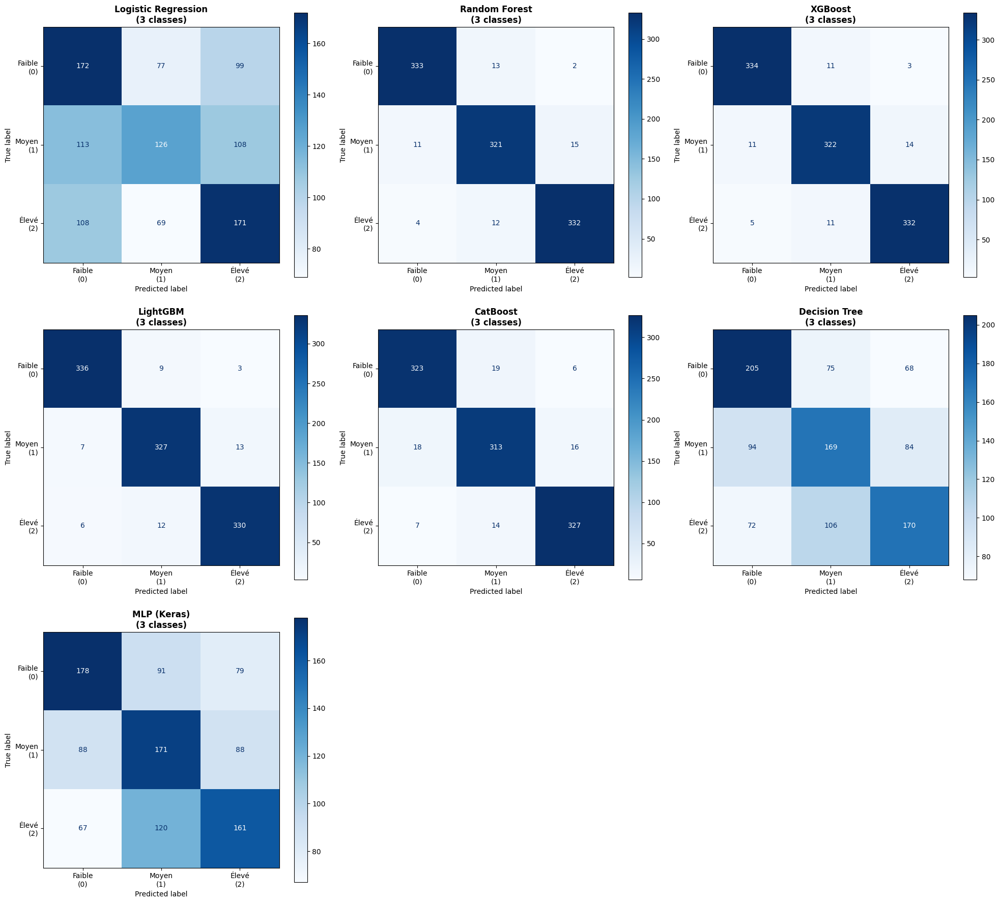
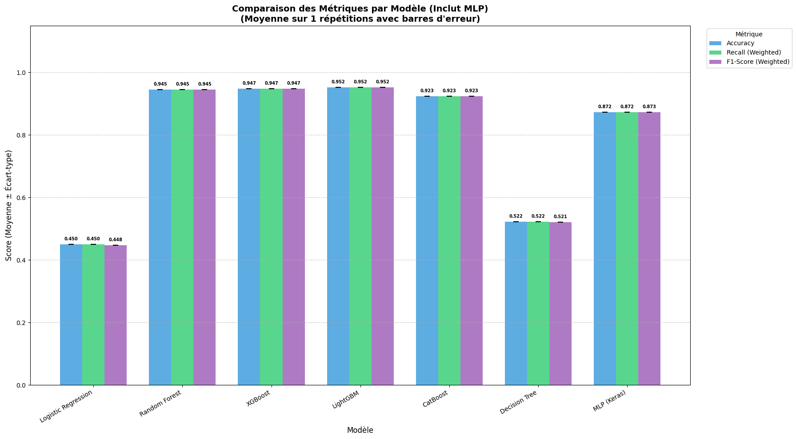
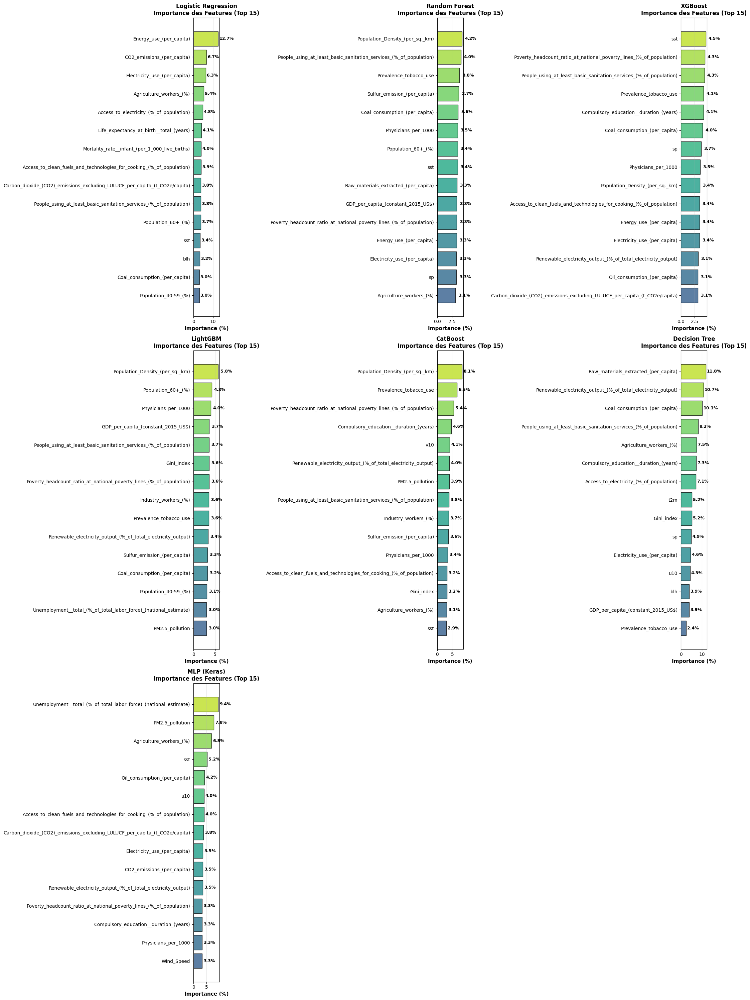

# COPD part

## First Predictions

At first, we took the dataset `1021/COPD_prevalence_rate.csv`, imputed missing values and encoded string values with functions in `data_preparation` file. Then, we wanted to see if a classification would show good results. For this, we separated observations in three equal size classes : `low`, `medium` and `high`. Then, we trained a **logistic regression**, **random forest** and **XGBoost**. Here are the results :

### Conufsion matrix

### Metrics

### Best features

## Second prediction TODO

Then, we enriched our dataset and added more years to get better results. Here, we used the `9019/COPD_prevalence_rate.csv`.

### Conufsion matrix

### Metrics

### Best features

### Conclusion for second part

We needed to make the `data_preparation.py` file more generic because it selected specified cols, so it did not work on every dataset. Then, the imputation we defined took 12 minutes on the new dataset which shape was (4950, 37), which was a lot of time. So we decided to keep the `IterativeImputer` but set `max_iter` at **5** and `n_nrearest` at **15** to impute faster. We also forgot to take country code out of the train and test sets, so we implemented this for the next parts.

## 1021 dataset without country and year in train/test

As said before, in this part, we executed our notebook without the counry code and year to get less bias and the metrics were weaker, but results may be better.

### Conufsion matrix

### Metrics

### Best features

### Conclusion

Now, we can see that `Random Forest` `XGBoost` use a lot `Surface area (sq. km)` for their predictions. This value is also correlated with the country and doesn't bring clear information. It may be interesting to replace this with the ratio `population per sq. km` because the density of population tells us more about the people environment. 

## Suppression of total variables

In this part, we deleted `GDP (current US$)`, `Surface area (sq. km)`, `Total area (Square Km)` and `Population, total` because they added bias in our models and modified `Sulphur oxides (tonnes)` and `Total sales of agricultural pesticides (tonnes)` by dividing them with the number of population to get a ratio. We obtained better metrics and more logical results.

### Conufsion matrix

### Metrics

### Best features

### Conclusion

Because XGBoost seems to love biased variables, we looked at the values of t2m and others temperatures variables, and we saw that these values have a lot of precision. For exemple, one of them is `298.236619`. Six digits after comma is useless. We will round them at one value after comma to follow the meteorological standard. We will also delete `d2m` and `skt` because they have a correlation of almost 1 with `t2m`. The correlation is logic they all are temperature measurement and having 3 times the same col gives just overfitting. 

## Modifying temperatures

Even after rounding them to 1 digit after comma, we got almost 350 unique temperatures. It was too much and this also brought bias. So we diced to roung them directly to the unit. We obtained the following results.

### Conufsion matrix

### Metrics

### Best features

### Conclusion

Now, we see that we don't have the same col multiple times.

## u10 problem

The ´u10´ variable is the vector on the west-east axis of the wind speed. A positive value means that the direction is from west to east and vice-versa. The problem with it is that it has a very high correlation of 0.74 with the target. This high correlation should be analyzed and explained. Indeed, it is highly unlikely that the wind direction itself has such a strong direct biological impact on the disease. Instead, this variable acts as a geographical proxy (or confounding variable). Positive values (Westerlies) predominantly characterize temperate zones in the Northern Hemisphere (e.g., Europe, North America), which tend to have aging populations and higher diagnosis rates. Conversely, negative values (Trade Winds) characterize tropical regions. Thus, the model is likely using ´u10´ to implicitly identify the latitude or development level of a country rather than evaluating the genuine physical effect of wind on pollution dispersion.

Conversely, the ´v10´ variable (North-South component) shows much lower importance. This is physically consistent with global atmospheric circulation patterns, which are predominantly zonal (East-West) due to the Earth's rotation. While ´u10´ creates distinct, stable bands separating tropical from temperate regions (and thus correlates with socio-economic factors), ´v10´ is highly variable and often averages out close to zero over a year. Consequently, it fails to act as a distinct geographic identifier for the model.

### Conclusion

To resolve this bias, we may want to combine ´u10´ and ´v10´ to also have the wind speed. To implement this new column, for each line, we will calculate $\sqrt{u10^2+v10^2}$.

## 9019 dataset with 100 different 80/20 splits

As proposed by Hector during the presentation, we executed 100 different 80/20 splits to have a larger view on the results. In the graphs below, we can see that there is no signifcant standard deviation.

## More models and MLP

We tested a custom MLP and various forest algorithms, all of which yielded excellent results. Interestingly, every model highlighted development indices as key predictors, suggesting a direct correlation between COPD and a country's development level. To refine our analysis, our next step involves creating a dataset with more comprehensive data on smoking habits.

## New dataset

Afer getting the previous results, we wanted to add more specific datas about the COPD. By reading the [CHUV's article on COPD](https://www.chuv.ch/fr/offre-en-soins/maladies/maladie/web_mld_321/bpco-bronchopneumopathie-chronique-obstructive), we learn that COPD is a group of diseases that cause an "airway blockage and breathing problems". We also learn that BPCO can be caused by tobacco, asthma, exposure to air polluants, genetic factors and respiratory infections. With all that new knowledge, we wanted to analyze the impcat of these indicators, compared to our initial indicators, on the prediction of our models. Before, the tobacco use was not used by our models because it has too many missing values, so it was droped by our pre-process functions. Here, we forced the pre-process to no drop this indicator and to fill missing values. Also, we specifically added the values :
- medical practitioners (to know if there is a problem of diagnostic)
- % of population age 65+ (because BPCO takes years to develop and is more present on older people. [BPCO : broncho-pneumopathie chronique obstructive](https://www.chu-lyon.fr/bpco-broncho-pneumopathie-chronique-obstructive))
- % of industry workers
- % of agricultural workes (to know if there is a difference between different the type of work)

### Conufsion matrix

### Metrics

### Best features

### Conclusion
We can see that our best F1-score dropped by 0,019, which negligeable and indicates that our performances are very close. The more interesting results are on the most used features. We can see that now `Random forest`, `XGBoost` and `CatBoost` have the tobacco use in their top 3 features, which with what the CHUV's page was telling. We can also see the the population density and the poverty count are still amongst the most used features. We will later analyze more precisely the behavior of those values. 

## 40-59 age class
This [article of CHU Lyon](https://www.chu-lyon.fr/bpco-broncho-pneumopathie-chronique-obstructive) suggests that BPCO starts to appear on people after 40 years of age. To analyse better this behavior, we will add the % of people 40-59 and replace the % of people 65+ by the % of people 60+ to have a more general coverage.

### Conufsion matrix

### Metrics

### Best features

### Conclusion
In the previous graph, we can observe that we obtained similar scores, which indicates that the models can class the prevalence correctly. Then, if we look more at the most important features, we can see that the best models still give a huge importance to the tobacco use and that lightGBM uses a lot the % of people 60+ and the physicians (doctors) per 1000 people. We also see that people 40-59 is not very important.

## Keep only years with no missing values for tobacco prevalence

## Find the best features in most cases
The problem with our implementation is that the notebook chooses only the best features for on random seed. Our goal is to find the best features for most cases and rank them.

