# COPD part

## First Predictions

At first, we took the dataset `1021/COPD_prevalence_rate.csv`, imputed missing values and encoded string values with functions in `data_preparation` file. Then, we wanted to see if a classification would show good results. For this, we separated observations in three equal size classes : `low`, `medium` and `high`. Then, we trained a **logistic regression**, **random forest** and **XGBoost**. Here are the results :

### Conufsion matrix
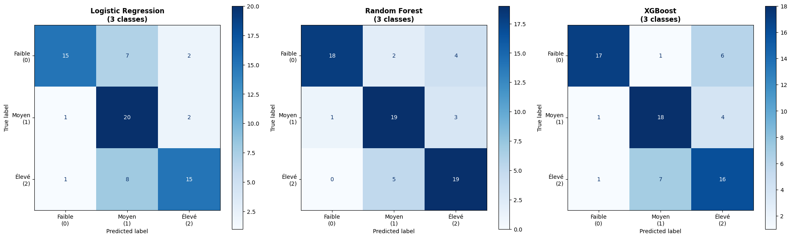

### Metrics
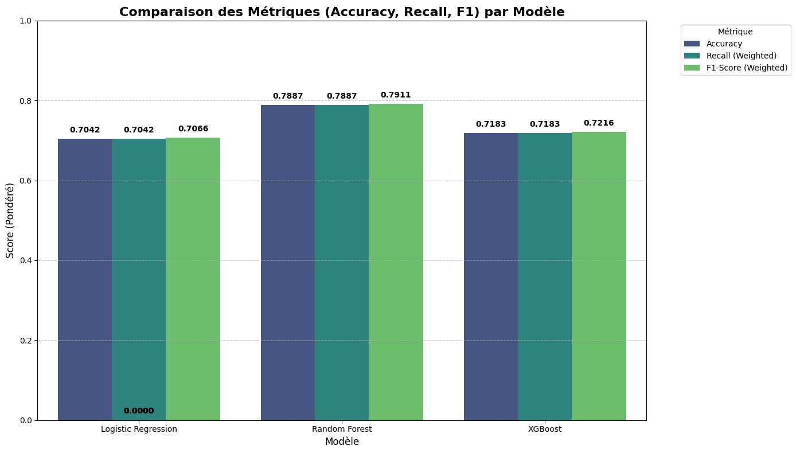

### Best features
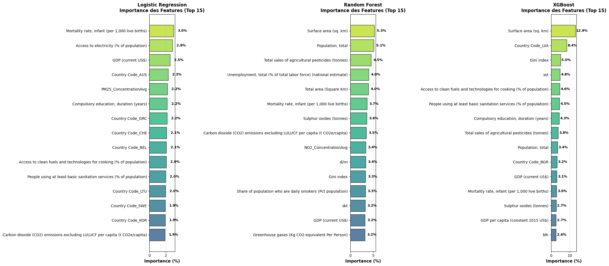

## Second prediction TODO

Then, we enriched our dataset and added more years to get better results. Here, we used the `9019/COPD_prevalence_rate.csv`.

### Conufsion matrix
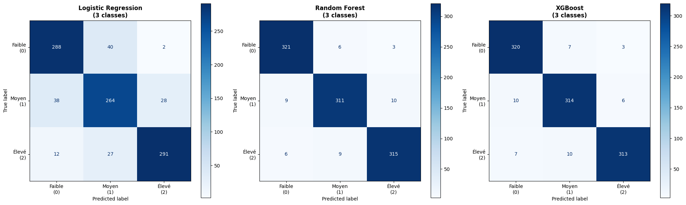

### Metrics
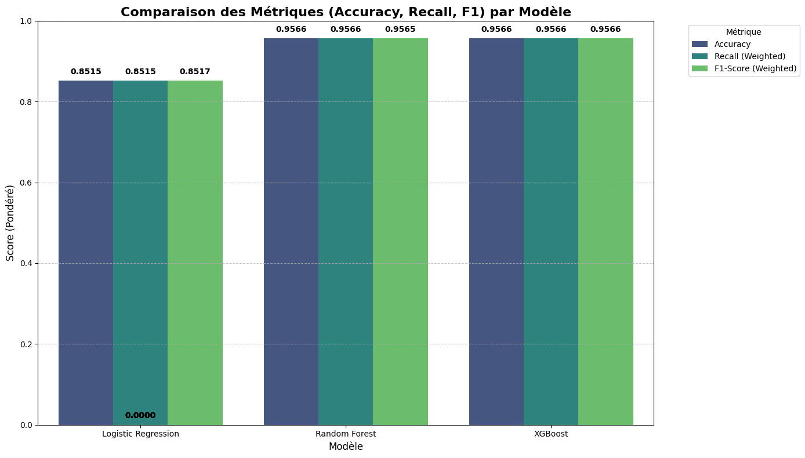

### Best features
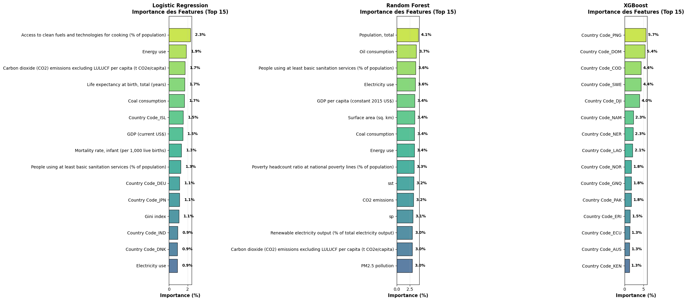

### Conclusion for second part

We needed to make the `data_preparation.py` file more generic because it selected specified cols, so it did not work on every dataset. Then, the imputation we defined took 12 minutes on the new dataset which shape was (4950, 37), which was a lot of time. So we decided to keep the `IterativeImputer` but set `max_iter` at **5** and `n_nrearest` at **15** to impute faster. We also forgot to take country code out of the train and test sets, so we implemented this for the next parts.

## 1021 dataset without country and year in train/test

As said before, in this part, we executed our notebook without the counry code and year to get less bias and the metrics were weaker, but results may be better.

### Conufsion matrix
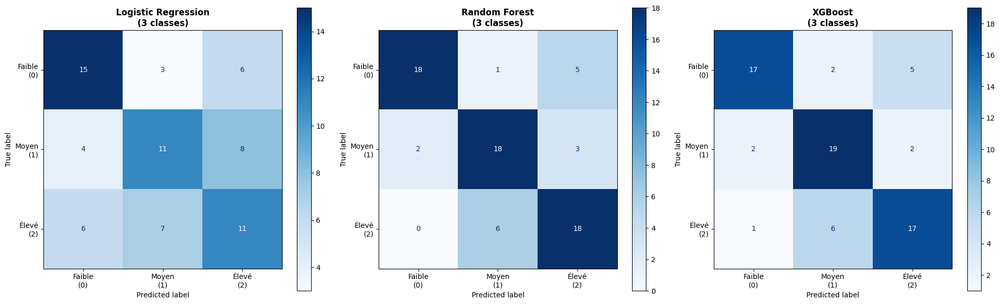

### Metrics
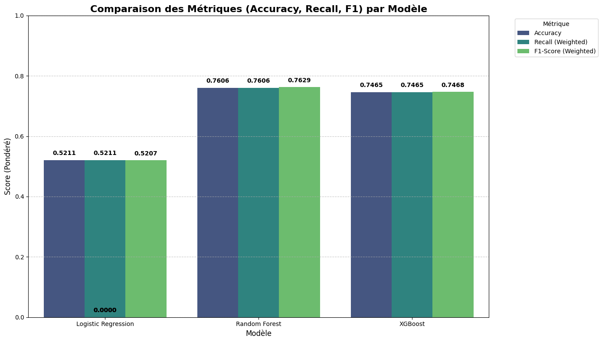

### Best features
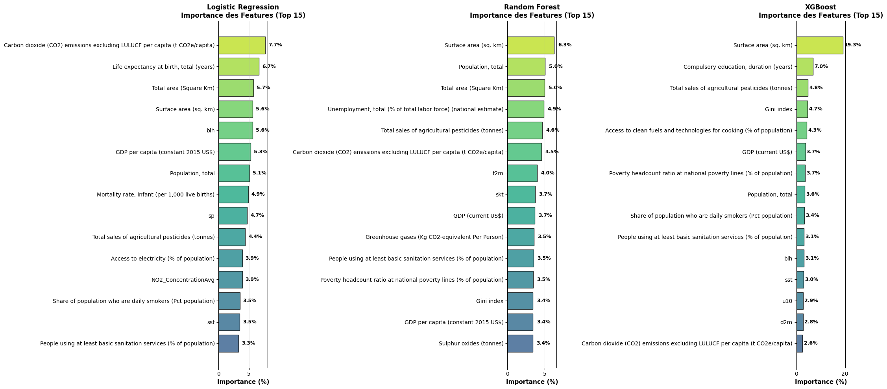

### Conclusion

Now, we can see that `Random Forest` `XGBoost` use a lot `Surface area (sq. km)` for their predictions. This value is also correlated with the country and doesn't bring clear information. It may be interesting to replace this with the ratio `population per sq. km` because the density of population tells us more about the people environment. 

## Suppression of total variables

In this part, we deleted `GDP (current US$)`, `Surface area (sq. km)`, `Total area (Square Km)` and `Population, total` because they added bias in our models and modified `Sulphur oxides (tonnes)` and `Total sales of agricultural pesticides (tonnes)` by dividing them with the number of population to get a ratio. We obtained better metrics and more logical results.

### Conufsion matrix
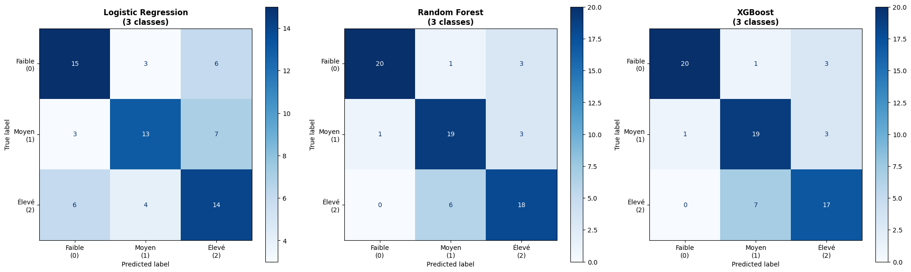

### Metrics
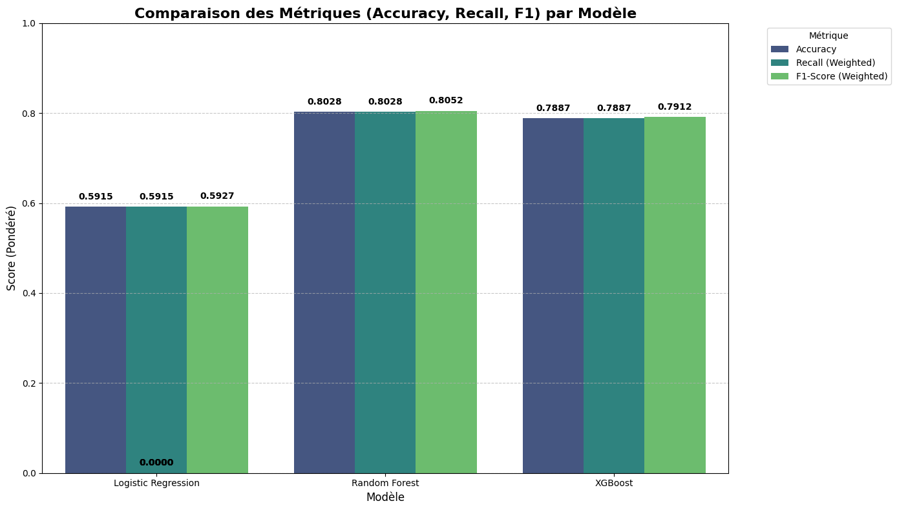

### Best features
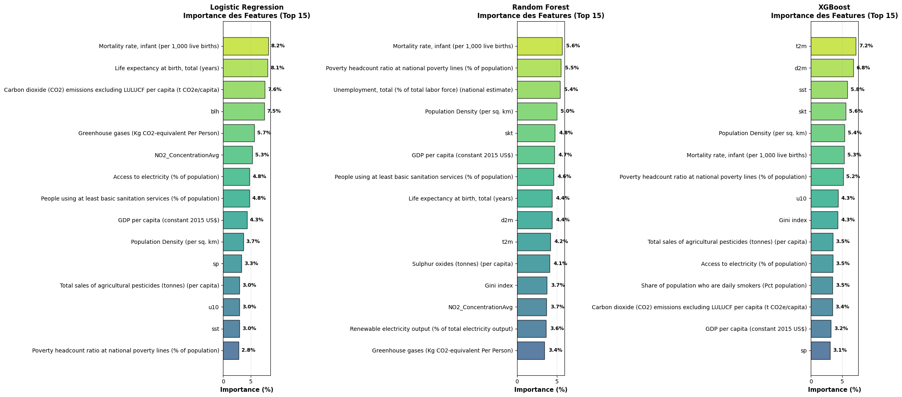

### Conclusion

Because XGBoost seems to love biased variables, we looked at the values of t2m and others temperatures variables, and we saw that these values have too much precision. For exemple, one of them is `298.236619`. Six digits after comma is useless. We will round them at one value after comma to follow the meteorological standard. We will also delete `d2m` and `skt` because they have a correlation of almost 1 with `t2m`.

## Modifying temperatures

Even after rounding them to 1 digit after comma, we got almost 350 unique temperatures. It was too much and this also brought bias. So we diced to roung them directly to the unit. We obtained the following results.

### Conufsion matrix
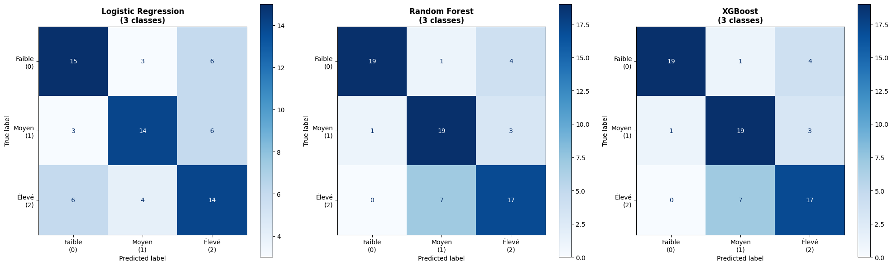

### Metrics
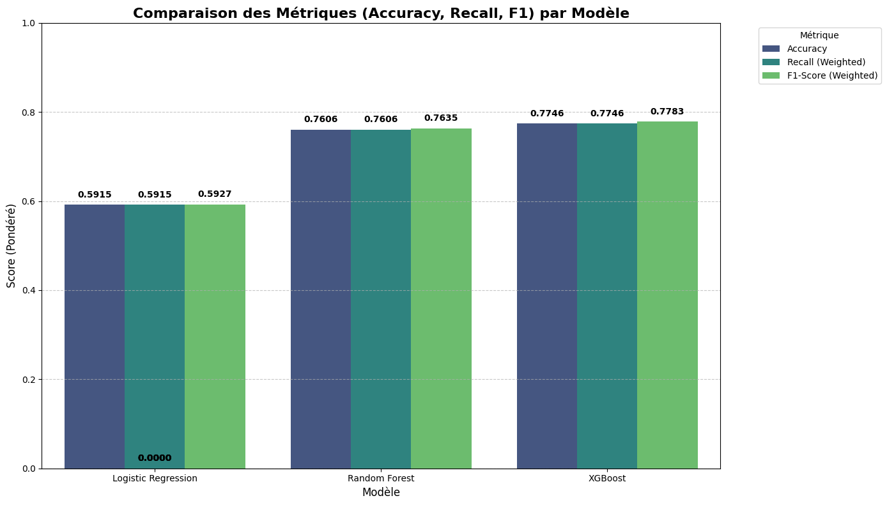

### Best features
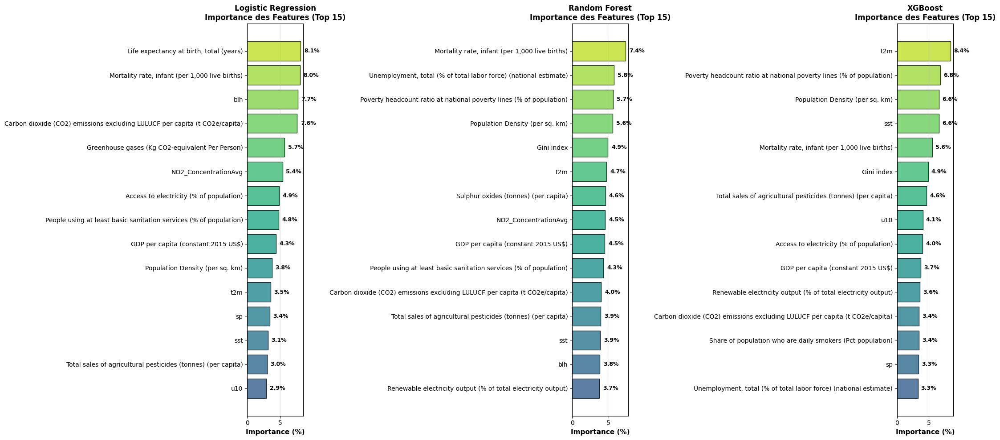

### Conclusion

Now, we see no real bias. But we should keep analysing each variable one by one to get clear results. We should also follow all the steps before every time we try a new dataset.